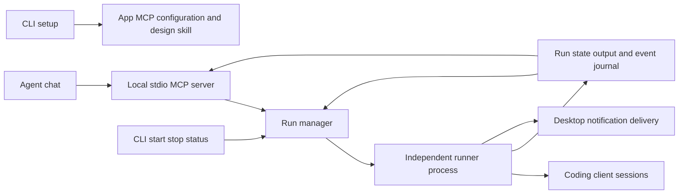

# Agent setup MCP control and desktop notifications

Investigation and implementation plan, 2026-10-07. Proposed work only.

The goal is to install Roadmap Runner once, configure a coding app with a roadmap
design skill and management tools, then start, stop and inspect runs from chat.
Runs and requested desktop alerts should survive a disconnected chat. Preserve
the existing foreground CLI, source/progress ownership, recovery behavior and
quota checkpoints.

## Existing implementation

| Area | Current behavior | Work required |
| --- | --- | --- |
| CLI | `bin/roadmap-runner.js:71` owns the foreground loop and calls `process.exit` | Extract a reusable lifecycle and add setup and management commands |
| Clients | `lib/clients.js` supports Codex, Claude, Gemini, Grok, Kimi and Muse | Keep execution adapters separate from app setup adapters |
| Process control | `lib/runner.js:130` launches workers in POSIX process groups and handles signals | Add persistent run identity, ownership, locks and control outside a foreground session |
| Output | Worker output is streamed; `onOutput` captures raw streams for supervision when enabled | Persist bounded runner output for status even with supervision disabled |
| Events | `lib/recovery.js:144` writes JSONL before invoking `ROADMAP_NOTIFY_BIN` | Extend lifecycle coverage and add replayable reads |
| Notifications | `examples/notify-macos.js` invokes AppleScript and alerts on several operational events | Add built-in macOS/Linux delivery with attention-only defaults |
| Skills | `docs/roadmap-writing-skill-plan.md` proposes `write-runner-roadmap` | Package the skill and connect installation to setup |
| MCP | `docs/mcp-events.md` contains a proposed bridge | Implement local control first; keep agent wake-up as separate optional work |

There is no managed start/stop/status CLI API today. Foreground launching and
Ctrl-C are the available control path. Existing events cover attention, recovery,
quota waits, deferred supervision, ordinary worker failures and completion. They
do not provide a complete start/stop/turn lifecycle, and some exit paths bypass
`runner.failed`.

## Protocol and app findings

The current [MCP Resources specification](https://modelcontextprotocol.io/specification/2026-07-28/server/resources)
uses `subscriptions/listen` with a resource filter to deliver resource-change
notifications. Older clients use `resources/subscribe`. Implement against the
protocol version actually supported by the selected SDK and client; do not mix
new subscription methods with an old handshake.

The [Triggers and Events working group](https://github.com/modelcontextprotocol/experimental-ext-triggers-events)
explicitly describes its repository as experimental. Its
[design sketch](https://github.com/modelcontextprotocol/experimental-ext-triggers-events/blob/main/docs/design-sketch-proposal.md)
proposes named events with poll, push and webhook delivery. Treat that interface
as an optional experimental adapter, not a universal client capability.
Neither a resource-change notification nor delivering an event establishes that
a host will wake an idle chat or show a user notification. Report transport support
and host behavior separately.

The [official TypeScript SDK](https://github.com/modelcontextprotocol/typescript-sdk)
now has a stable v2 line with split server/client packages; v1 remains maintained
for a transition period. Before implementation, pin a released server SDK, check
its Node requirements against this package's current `>=18` declaration, and prove
compatibility with the initial target clients using prepared JSON-RPC exchanges.
Prefer v2 if those checks pass; make any engine change explicit. Do not install a
dependency from `main` or assume an old SDK supports new methods.

| Initial app | MCP configuration | Skill installer agent ID |
| --- | --- | --- |
| Codex | `.codex/config.toml` for trusted projects; user configuration under `~/.codex` | `codex` |
| Claude Code | Project `.mcp.json`; native CLI supports project/user scopes | `claude-code` |
| Grok Build | Project `.grok/config.toml` or user `~/.grok/config.toml`; native CLI supports project scope | `grok` |

These are coding clients, not a promise of local stdio support in their web chats.
Sources: [official OpenAI documentation](https://developers.openai.com/codex/mcp),
[Claude Code MCP](https://code.claude.com/docs/en/mcp),
[Grok Build MCP](https://docs.x.ai/build/features/mcp-servers), and
[skills CLI](https://github.com/vercel-labs/skills).

## Proposed architecture



Use one independent process per managed run and a shared filesystem registry.
A global daemon, network listener and hosted service are unnecessary for the first
release. The MCP server is a control and observation adapter; closing it must not
kill an intentionally backgrounded run. The worker owns lifecycle state, event
writes and desktop delivery. MCP servers read the same durable state after reconnect.

Store private run metadata under a platform-appropriate user state directory,
with per-run IDs, canonical workspace/roadmap/progress paths, runner PID, ownership
token, heartbeat, timestamps, options, terminal outcome and artifact paths. Keep
existing progress, history and recovery files compatible. One active run per
canonical workspace prevents competing agents editing the same checkout; use a
separate worktree for concurrent work. Also lock the progress path so aliases or
custom progress paths cannot bypass exclusion.

Start reserves the lock before spawning and returns only after the worker signals
readiness. Repeated requests with the same idempotency key return the same run.
Existing conflicting work returns its run ID and a useful conflict response.
Reconcile stale records without guessing that a reused PID belongs to the runner.
Use authenticated local control, such as a private per-run Unix socket, to request
stop and verify ownership; raw PID lookup alone is insufficient. A stale record
is an unknown/interrupted outcome until reconciled, never inferred completion.

Move signal handling to the runner lifecycle so stop works during worker execution,
supervision, quota waits, recovery waits and notification delivery. Preserve
process-group cleanup and bounded escalation. Stop is idempotent; acknowledge
`stopping` promptly and expose final `stopped` only after descendants are gone.
Unexpected worker-process death remains observable after MCP reconnection.

## CLI setup and skill installation

Proposed commands:

```sh
roadmap-runner setup --app codex --app claude --app grok --scope project
roadmap-runner setup --app codex --scope user --dry-run
roadmap-runner mcp --workspace /absolute/path/to/project
roadmap-runner start roadmap.md --client codex --notify attention
roadmap-runner status <run-id> --json
roadmap-runner stop <run-id>
```

Keep `roadmap-runner roadmap.md` as the compatible foreground form. Setup is an
explicit command after installation; package installation must not silently edit
app configuration or install skills. No app argument can offer detected targets
interactively; noninteractive callers must name their targets.

An app adapter defines detection, supported scopes, MCP registration, skill ID,
configuration validation and a connectivity check. Prefer native MCP registration
commands when they can meet scope and preservation requirements. Otherwise merge
the single Roadmap Runner entry with a format-aware editor. Preserve unrelated
settings and TOML comments, reject conflicting entries without replacing them,
write atomically, and keep a narrowly scoped backup. Repeated setup is a no-op
when configuration matches. Dry-run shows commands, paths and intended changes.

Register an absolute Node executable and installed package entrypoint where
possible, with an explicit workspace binding. Avoid downloading the newest runner
on every MCP launch. User-wide configuration must select an authorized workspace
explicitly; an app's launch directory or an agent-supplied path is insufficient.
If roots are supported, validate against them as well as configured allowed roots.

Publish `skills/write-runner-roadmap/` containing the workflow, task contract and
template already planned in `docs/roadmap-writing-skill-plan.md`. Include it in the
npm package's `files` list. Keep roadmap design independent of execution; invoking
the design skill must not start a paid runner automatically.

When an available, compatible skills installer can be used, the intended command
shape is:

```sh
npx skills add <installed-package>/skills --skill write-runner-roadmap --agent codex --yes
```

Use the matching agent ID and `--global` for user scope. The local source keeps
skill and runner versions aligned. Prefer an installed `skills` binary; use `npx`
when available, with a tested pinned installer version if it needs downloading.
Pass arguments directly without shell interpolation. If unavailable/offline, copy
the bundled skill to the documented app directory and record runner version and
ownership for safe upgrades. Never overwrite a user-modified skill automatically.
Report MCP and skill outcomes independently so partial setup is repairable.

Codex, Claude Code and Grok Build are the initial verified adapters. Gemini, Kimi
and Muse execution support stays available; scaffolding support follows verification
of their MCP and skill interfaces rather than assuming equivalent configuration.

## MCP tool and status contract

Ship three tools initially:

| Tool | Input | Result |
| --- | --- | --- |
| `roadmap_start` | Workspace, roadmap, supported runner options, optional idempotency key and notification preferences | Run ID, initial state, artifact/resource references and effective options |
| `roadmap_stop` | Run ID | Current stopping/terminal state and whether this request changed it |
| `roadmap_status` | Optional run ID, bounded output size and event cursor | One run with recent output/events, or a paginated workspace run list |

`roadmap_start` returns promptly; it does not hold a tool call for the lifetime of
the roadmap. Restrict launch options to the supported schema, validate canonical
paths and symlinks against allowed workspace roots, and require roadmap/progress
paths to belong to that workspace. Do not expose arbitrary commands, environment
variables or executable overrides as model-controlled tool arguments.

Separate `processState` (`starting`, `running`, `stopping`, `stopped`, `exited`,
`unknown`) from `roadmapState` (`in_progress`, `blocked`, `complete`) and `waitReason`
(`quota`, `capacity`, `recovery`, or null). This preserves the existing fact that
BLOCKED is nonterminal. Include turn number/role, exit reason/code, timestamps,
heartbeat, quota reset/deadline and task IDs requiring attention.

Capture runner messages and normalized client output regardless of supervision
configuration. Keep raw supervision evidence separate. Suggested bounds: 1 MiB
rotating managed log, 8 KiB default status tail and 32 KiB maximum response budget;
return truncation flags and continuation cursors. Strip terminal control sequences,
redact known credential patterns, and treat remaining output as untrusted local
content. Output may still contain sensitive project text; never place it in desktop
alerts or event notifications.

Expose `roadmap://<run-id>/state` and cursor-based event access. Keep protocol stdout
exclusively JSON-RPC and diagnostics on stderr. Annotate status read-only and
start/stop as mutating tools. Prevent the spawned roadmap worker from launching a
nested runner or controlling its parent: propagate worker context and enforce the
restriction in management operations, rather than relying only on skill wording.

## Event model and monitoring

Extend the existing envelope additively with `runId`, a monotonic per-run sequence,
source revision, role/turn where relevant, severity, attention classification and
a short reason code. Preserve existing event IDs and types. Existing journals
remain readable; a resumed managed process gets a new run ID while recovery and
blocker fingerprints continue across attempts.

| Event or event family | Behavior |
| --- | --- |
| `runner.started` | Worker initialized, locks acquired and ready |
| `runner.stopped` | Requested stop finished; includes initiator/reason |
| `runner.turn_starting`, `runner.turn_finished` | Worker or supervisor session boundary; finished includes outcome |
| Existing `runner.blocked`, `runner.needs_attention`, `runner.unblocked` | Preserve recovery semantics and task attention |
| Existing `runner.usage_paused`, `runner.usage_resumed`, `runner.usage_wait_expired` | Quota incident and bounded reset wait |
| `runner.turn_limit_reached` | Session duration elapsed; runner can continue with a fresh turn |
| `runner.capacity_wait`, `runner.capacity_exhausted` | Transient capacity backoff and exhausted retry budget |
| Existing `runner.failed`, `runner.completed` | Cover all appropriate terminal failure/completion paths |

Do not collapse all limits into one type. In chat, “notify me when limit reached”
should resolve a notification preference, with quota as the documented default
and turn/capacity limits separately selectable. For example, starting with
`notifyOn: ["runner.usage_paused"]` arms one desktop alert per quota incident even
if the client subsequently disconnects. Attention-only remains the general default.

Persist before delivery. Replay only complete journal records, tolerate a partial
trailing write, bound reads and retain an explicit cursor-expired response when
retention removes history. Event consumers deduplicate by ID; attention delivery
also uses blocker fingerprints. Delivery is best effort with replay and deduplication,
not an exactly-once promise across crashes.

The baseline monitor uses status/event reads and standard resource subscriptions
where supported. New-protocol subscriptions and legacy subscriptions must follow
their respective contracts. Add the experimental named-event interface only behind
explicit capability negotiation after the baseline is qualified. No webhooks or
remote hosting are needed in this release.

Three tools support monitoring preferences at start. Changing a watch on an already
running job deserves a later explicit `roadmap_watch` tool; keep status read-only.
Chat alerts or waking an idle turn require demonstrated host support or a separately
authorized host adapter. Do not claim “monitoring in chat” merely because a desktop
notification was armed. If unsupported, describe the available desktop alert and
status access clearly. Automatic recovery agents remain outside this scope.

## Desktop notification policy

Add `--notify attention|off` and explicit event selection, shared by foreground CLI
and managed starts. New installations default to attention delivery when the
backend is available; absence of a graphical session is a nonfatal unavailable
backend. Preserve `ROADMAP_NOTIFY_BIN` for external integrations independently.

Attention defaults: a new/changed blocker, a needs-input task, a terminal failure,
capacity exhaustion or quota wait expiry. Suppress ordinary starts, stops,
turn boundaries, successful completion, backoff ticks and automatically recoverable
quota pauses. Allow explicit quota alerts for the requested limit-notification use
case. Determine attention from task reasons/status, not just every SKIPPED flag.

macOS can reuse the existing direct `osascript` approach with arguments, a timeout
and no shell. Linux can invoke `notify-send` when available, using the desktop
session notification service described by the
[freedesktop notification specification](https://specifications.freedesktop.org/notification/latest-single/).
Do not install system packages automatically. Headless Linux, SSH sessions and
disabled desktop notifications must leave runner work intact and produce one
bounded diagnostic. A successful backend command means submitted, not proven seen.

Use a short title, roadmap basename, task IDs and an instruction to inspect status
or progress. Never include model output, secrets or full blocker evidence. Persist
deduplication state, coalesce task changes, and use a bounded asynchronous delivery
queue so a slow notification command cannot pause work. Record failures for later
inspection; desktop alerts remain best effort. Do not add click-to-execute actions
or agent dispatch in the initial implementation.

## Implementation sequence and acceptance

All tasks below are proposed. Each implementation task includes deterministic
validation and an evidence record; no task is complete merely because it compiles.

| Task | Dependencies | Deliverable and acceptance |
| --- | --- | --- |
| INT-1 Lifecycle extraction | None | Move orchestration from `main` into a reusable lifecycle, replace deep exits with explicit outcomes, own signals at lifecycle level. Prepared fixtures preserve foreground behavior, quota deadlines, supervision and stop during every wait. |
| INT-2 Run management | INT-1 | Independent worker entrypoint, private registry/control endpoint, workspace/progress locks, readiness and idempotency. Prepared processes prove concurrent-start exclusion, disconnect survival, stale identity handling and full process-tree stop. |
| INT-3 State output and events | INT-1; INT-2 for managed identity | Bounded output, state dimensions, missing lifecycle events and cursor reads. Verify supervisor-disabled capture, all exit paths, malformed/partial journals, retention and exact event ordering with fixtures. |
| INT-4 Desktop notifications | INT-3 | macOS/Linux adapters, attention filters, explicit limit preferences and persisted deduplication. Stub executable transports prove filtering, timeout/failure isolation, headless handling and restart behavior. |
| INT-5 Local MCP | INT-2 and INT-3; INT-4 for start-time desktop preferences | Three tools and state/event resources with a pinned compatible SDK. Prepared client exchanges prove schema validation, bounds, stdout purity, workspace restrictions, worker recursion prevention and reconnect behavior. |
| INT-6 Skill and app setup | Skill packaging can begin independently; INT-5 before operational registration | Bundle the planned roadmap skill and Codex/Claude/Grok adapters. Temporary configuration fixtures prove both scopes, preserving settings, conflicts, idempotency, dry-run, unavailable installer fallback and partial failure recovery. Package inspection includes skill assets. |
| INT-7 Protocol event adapter | INT-3 and INT-5 | Qualify modern/legacy subscriptions with prepared clients. Implement experimental named events only where a supported client contract exists; preserve polling fallback and honest host capability reporting. |

Suggested new modules: `lib/lifecycle.js`, `lib/run-manager.js`,
`lib/run-state.js`, `lib/events.js`, `lib/notifications.js`, `lib/mcp.js`,
`lib/setup.js` and app-specific setup adapters. Keep existing client execution,
tracking, supervision and recovery logic in their established modules; extract
only the shared boundaries needed for these features.

Ship the first usable slice with managed start/stop/status, basic MCP and attention
notifications. Setup and the design skill make the next slice easy to install.
Experimental event delivery and host-specific chat wake-up must not block either.

Before changing or running AI tests, read
`architecture/operations/paid-inference-testing-policy.md` in the Assign workspace.
Use existing mock CLIs, prepared JSON-RPC transcripts and stub notification commands;
never launch real provider clients, record live fixtures or load `.secrets` in tests.
Readiness checks may exercise MCP without starting an inference-backed run. Live
content dogfood is a separate manual workflow requiring exact content, a user-approved
hard request/monetary cap and stop condition before any provider call. Setup must
not start a runner as its connectivity test.

## Decisions for implementation

Recommended defaults are project-scoped setup, Codex/Claude/Grok adapters, one
managed run per workspace, local stdio MCP, attention-only desktop alerts and no
automatic agent wake-up. Explicit notification filters enable quota alerts.

Resolve SDK/Node compatibility first using dependency metadata and prepared protocol
clients. Confirm configured Grok is Grok Build rather than an unrelated executable.
Keep changing watches on existing runs and host-specific chat alerts as explicit
follow-up scope. Real desktop visibility and idle-chat reactions need separate
manual evidence; mocked delivery cannot establish those outcomes.
